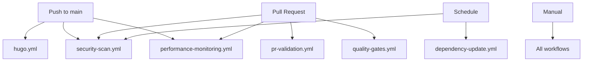

# CI/CD Workflows Documentation

This directory contains GitHub Actions workflows that implement a comprehensive CI/CD pipeline for the Hugo slideshow site. All workflows follow 2025 best practices for security, performance, and maintainability.

## Workflows Overview

### 🚀 Production Workflows

#### `hugo.yml` - Main Deployment
- **Trigger**: Push to `main` branch, manual dispatch
- **Purpose**: Builds and deploys the Hugo site to GitHub Pages
- **Features**:
  - Latest Hugo v0.148.2 with extended features
  - Advanced caching for Hugo modules and Go dependencies
  - Path-based filtering to skip unnecessary builds
  - Full submodule and git history support
  - Optimized build with garbage collection and minification

#### `pr-validation.yml` - Pull Request Validation
- **Trigger**: Pull requests to `main` branch
- **Purpose**: Validates changes before they're merged
- **Features**:
  - Hugo module verification and graph analysis
  - Content structure validation
  - Broken link detection
  - Image reference validation
  - Build error checking

### 🔒 Security Workflows

#### `security-scan.yml` - Security Scanning
- **Trigger**: Push/PR to `main`, weekly schedule (Sundays 2 AM UTC)
- **Purpose**: Comprehensive security scanning
- **Features**:
  - Trivy vulnerability scanning with SARIF output
  - Go vulnerability checking with govulncheck
  - Secrets scanning with Trufflehog
  - CodeQL analysis for Go and JavaScript
  - Results uploaded to GitHub Security tab

### 🔧 Maintenance Workflows

#### `dependency-update.yml` - Automated Updates
- **Trigger**: Weekly schedule (Mondays 9 AM UTC), manual dispatch
- **Purpose**: Keeps dependencies up to date
- **Features**:
  - Hugo module updates with `hugo mod get -u`
  - GitHub Actions version updates
  - Automated PR creation with detailed change descriptions
  - Proper labeling and branch management

#### `performance-monitoring.yml` - Performance Analysis
- **Trigger**: Push/PR to `main`, manual dispatch
- **Purpose**: Monitors build performance and site optimization
- **Features**:
  - Build time measurement
  - Memory usage tracking
  - Asset size analysis
  - Large file detection
  - PR comments with performance reports

#### `quality-gates.yml` - Quality Control
- **Trigger**: Pull requests to `main`
- **Purpose**: Enforces code quality standards
- **Features**:
  - Go linting with golangci-lint
  - Markdown formatting validation
  - YAML file validation
  - Build testing with and without drafts
  - Size impact analysis with automatic PR comments

## Configuration Files

### `.yamllint.yml`
YAML linting configuration for workflow files:
- Line length limit: 120 characters
- Allows common boolean values
- Enforces consistent spacing

### `.golangci.yml`
Go linting configuration with comprehensive rule set:
- Timeout: 5 minutes
- Go version: 1.21
- 30+ enabled linters for code quality
- Local import prefix configuration

## Key Features & Best Practices

### 🔐 Security
- **Least Privilege**: Minimal required permissions for each workflow
- **OIDC Ready**: Prepared for OpenID Connect authentication
- **Secret Management**: No hardcoded secrets, uses GitHub secrets properly
- **Supply Chain Security**: Pin action versions, scan dependencies

### ⚡ Performance
- **Smart Caching**: Hugo modules, Go dependencies, and build artifacts
- **Parallel Execution**: Independent jobs run concurrently
- **Path Filtering**: Skip builds for documentation-only changes
- **Resource Optimization**: Use ubuntu-22.04 for latest features

### 🛡️ Reliability
- **Concurrency Control**: Prevent conflicting deployments
- **Error Handling**: Proper exit codes and error reporting
- **Retry Logic**: Built into GitHub Actions by default
- **Monitoring**: Performance tracking and alerting

### 📊 Observability
- **Build Metrics**: Time, memory usage, asset sizes
- **Security Reports**: Vulnerability scanning results
- **Quality Metrics**: Linting results, test coverage
- **Performance Trends**: Track changes over time

## Environment Variables

Common environment variables used across workflows:

```yaml
env:
  HUGO_VERSION: 0.148.2      # Latest Hugo version
  HUGO_CACHEDIR: /tmp/hugo_cache  # Predictable cache location
  GO_VERSION: "1.21"         # Go version for module management
```

## Workflow Dependencies



## Troubleshooting

### Common Issues

1. **Build Failures**
   - Check Hugo version compatibility
   - Verify module dependencies in `go.mod`
   - Review build logs for specific errors

2. **Cache Issues**
   - Clear workflow caches in GitHub repo settings
   - Check cache key generation in workflows

3. **Permission Errors**
   - Verify GITHUB_TOKEN permissions
   - Check repository settings for Actions permissions

4. **Deployment Failures**
   - Confirm GitHub Pages is enabled
   - Check Pages deployment source is set to Actions

### Monitoring

- **Security**: Check the Security tab for vulnerability reports
- **Performance**: Review workflow run artifacts for performance reports
- **Quality**: Monitor PR comments for quality gate results
- **Dependencies**: Watch for automated dependency update PRs

## Maintenance

### Monthly Tasks
- Review security scan results
- Update action versions if needed
- Check performance trends
- Review and merge dependency updates

### Quarterly Tasks
- Audit workflow permissions
- Review and update linting rules
- Evaluate new GitHub Actions features
- Update documentation

## Migration Notes

This CI/CD setup replaces the previous basic workflow with:
- ✅ Updated Hugo from v0.108.0 to v0.148.2
- ✅ Updated all GitHub Actions to latest versions
- ✅ Added comprehensive security scanning
- ✅ Implemented performance monitoring
- ✅ Added automated dependency management
- ✅ Enhanced quality gates and validation
- ✅ Optimized caching and build performance